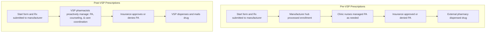
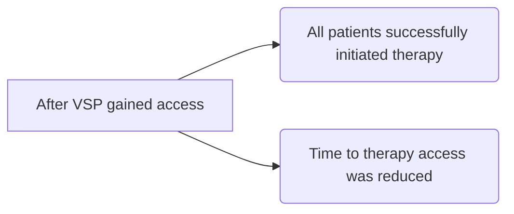

# Impact of an Integrated Specialty Pharmacy Model on Patient Access to Dalfampridine

VANDERBILT UNIVERSITY MEDICAL CENTER

Gabrielle Givens, PharmD1 | Aimee Banks, PharmD, BCPS, MSCS2 | Josh DeClercq, MS3 | Leena Choi, PhD3 | Autumn Zuckerman, PharmD, BCPS, AAHIVP, CSP2 | Megan Peter, PhD2
1 Lipscomb University College of Pharmacy, 2 Specialty Pharmacy, Vanderbilt University Medical Center, 3 Department of Biostatistics, Vanderbilt University Medical Center

## BACKGROUND

Dalfampridine, an oral specialty medication, improves walking speed in patients with multiple sclerosis (MS).1

Access to specialty medications can be hindered by:

* Limited Distribution Networks (LDNs) imposed by manufacturers, which restrict procurement and dispensing of medications to only one or a few pharmacies, often excluding health-systems specialty pharmacies (HSSP).

* Insurance restrictions, high costs, and challenges navigating specialty pharmacies.2

Integrated HSSPs often embed pharmacists within clinics and dispense medications from their internal pharmacy.3

## OBJECTIVE

To assess the impact of an integrated HSSP model on access to dalfampridine by comparing access to therapy before and after Vanderbilt Specialty Pharmacy (VSP) gained admission to the limited distribution network (LDN).

## Figure 1. Prescription Timeline

Rx=Prescription, PA=Prior authorization, VSP = Vanderbilt Specialty Pharmacy

## METHODS

| DESIGN   | Single center retrospective cohort study                                                                                                                                                                                                                                                   |
| -------- | ------------------------------------------------------------------------------------------------------------------------------------------------------------------------------------------------------------------------------------------------------------------------------------------ |
| SAMPLE   | Inclusion: Adult patients with MS starting or restarting dalfampridine by a VUMC provider from March 2010 to December 2018 Exclusion: Prescriptions initiated with an external pharmacy by a non-VUMC provider and those without documentation of the original prescription in the eMR |
| OUTCOMES | 1. Insurance approval 2. Medication access time: time from decision-to-treat to insurance approval 3. Rate of therapy initiation                                                                                                                                                   |

## RESULTS

## Figure 2. Median time from decision to treat to insurance approval

| Date of Decision to Treat | 2010 | 2011 | 2012 | 2013 | 2014 | 2015 | 2016 | 2017 | 2018 (Pre) | 2018 (Post) |
| ------------------------- | ---- | ---- | ---- | ---- | ---- | ---- | ---- | ---- | ---------- | ----------- |
| n                         | 70   | 36   | 34   | 32   | 26   | 23   | 20   | 14   | 5          | 25          |
| Median                    | 25   | 15   | 18.5 | 29   | 29   | 42   | 15.5 | 38   | 14         | 1           |

## Prescriptions

* Twenty-six patients had more than one prescription due to prior discontinuation or lapse in therapy, resulting in 285 dalfampridine prescriptions from 258 patients.

* Most (84%) prescriptions were new starts, 16% were restarts after a prior lapse or discontinuation.

Upward arrow icon **Post-VSP, rates of insurance approval and number of patients starting therapy increased to 100%. (Figure 3).**

**Post-VSP, median access time decreased to 1 day (IQR 0 - 3) (Figure 2).** Downward arrow icon

## Table 1. Sample Characteristics

| Characteristic                       | Mean \[SD] or n (%) |
| ------------------------------------ | ------------------- |
| Patient characteristics (n=258)      |                     |
| Age, years                           | 52 \[11]            |
| Gender, female                       | 174 (67%)           |
| Race, Caucasian                      | 228 (88%)           |
| Prescription characteristics (n=285) |                     |
| Patient diagnosis                    |                     |
| Relapse Remitting MS                 | 118 (41%)           |
| Secondary Progressive MS             | 107 (38%)           |
| Primary Progressive MS               | 58 (20%)            |
| Transverse Myelitis                  | 2 (<1%)             |
| Patient ambulatory status            | 261 (92%)           |
| Concurrent DMT use                   | 144 (51%)           |

MS=multiple sclerosis
DMT=Disease Modifying Therapy

## Figure 3. Prescription Outcomes

| Outcome                     | Pre-VSP (n = 260) | Post-VSP (n = 25) |
| --------------------------- | ----------------- | ----------------- |
| Insurance Approval Rate (%) | 95                | 100               |
| Patient Started Therapy (%) | 93                | 100               |

## CONCLUSIONS

* After VSP gained access to dispense dalfampridine:

* Limited Distribution Networks (LDNs) may delay or inhibit access to specialty medications for patients of health systems with integrated specialty pharmacies.

## REFERENCES

1. AMPYRA (dalfampridine) [package insert]. Ardsley, NY: Acorda Therapeutics, Inc.; 2017.

2. Karas L, Shermock KM, Proctor C, et al. Limited distribution networks stifle competition in generic and biosimilar drug industries. Am J Manag Care. 2018 Apr 1;24(4):e122-e127

3. Bagwell A, Kelley T, Carver A, et al. Advancing Patient Care Through Specialty Pharmacy Services in an Academic Health System. J Manag Care Spec Pharm. 2017;23(8):815-820.

