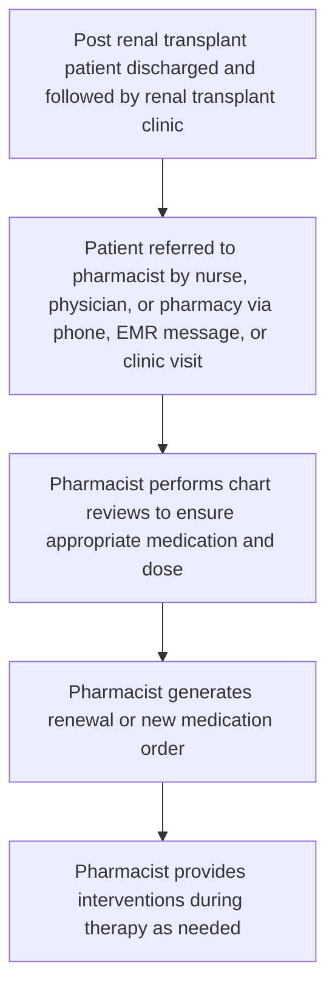
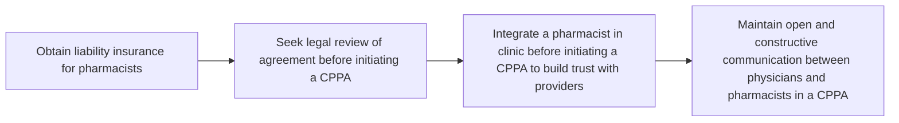

# ASSESSING INTERVENTIONS TO IMPROVE PATIENT CARE CONDUCTED BY PHARMACISTS AT AN OUTPATIENT RENAL TRANSPLANT CLINIC WITHIN A COLLABORATIVE PHARMACY PRACTICE AGREEMENT
VANDERBILT UNIVERSITY MEDICAL CENTER logo

Rachel Chelewski, PharmD, CSP1 | Keren Johnson, PharmD, CSP1 | Autumn Zuckerman, PharmD, BCPS, AAHIVP, CSP2 | Megan Peter, PhD2 | Anthony Langone, MD3
Email Keren Johnson for correspondence: keren.e.johnson@vumc.org

1 Vanderbilt Transplant Pharmacy, 2 Vanderbilt Specialty Pharmacy, 3 Vanderbilt University Medical Center, Department of Medical Specialties

## BACKGROUND

* Collaborative pharmacy practice agreements (CPPA) permit pharmacists to perform clinical services under a supervising physicians without direct intervention.
* The Vanderbilt Renal Transplant Clinic implemented a CPPA in March 2017.

### Figure 1. Pharmacist Responsibilities

* **Medication changes\***
    * Taper and discontinue medications per protocols
    * Renew and generate orders for non-controlled medications
* **Patient education**
    * Medication counseling for post-transplant patients
* **Drug information resource**
    * Provide medication and dosing information to providers and nursing staff
* **Treatment access**
    * Complete insurance prior authorizations and appeals for medication approval
    * Obtain financial assistance as needed

\* Actions supported by CPPA

## METHODS

| Study Design | Study Design                                                                                      | Interventions                                 | Interventions                                                                                                                 |
| ------------ | ------------------------------------------------------------------------------------------------- | --------------------------------------------- | ----------------------------------------------------------------------------------------------------------------------------- |
| Sample       | Adult patients prescribed medication from the renal transplant clinic from 1/01/2019 to 6/30/2019 | Medical record assessment                     | Evaluate patient-specific information to facilitate medication prescribing, adjustment, continuation, or coordination of care |
| Data Source  | Retrospective review of clinic notes in patient electronic medical records (EMR)                  | Medication counseling                         | Educate patients in clinic or by phone on drug-specific information based on need                                             |
| Objective    | Evaluate interventions performed by pharmacists in a CPPA at a renal transplant clinic            | Resolving barriers to medication continuation | Identify and address potential issues that may impact medication persistence                                                  |

### Figure 2. Clinic Workflow

**Steps Performed in Chart Reviews for Orders**
* [x] Verify CPPA referral on file
* [x] Verify last clinic visit occurred within 12 months
* [x] Review EMR for medication changes
* [x] Review laboratory results
* [x] Update medication list if appropriate

| 1,233 Patients                           |          | 5,793 Pharmacist-generated prescriptions |   |
| ---------------------------------------- | -------- | ---------------------------------------- | - |
| 5% Patients' orders audited by physician | \[arrow] | 0 Errors identified                      |   |
| 1,821 Chart reviews performed            | \[arrow] | 3,852 Pharmacist interventions preformed |   |

### Figure 3. Types of Pharmacist Interventions

| Category                                      | Percentage |
| --------------------------------------------- | ---------- |
| Medical Record Assessment                     | 19%        |
| Medication Counseling                         | 11%        |
| Resolving Barriers to Medication Continuation | 70%        |

## RESULTS

### Table 1. Pharmacist Interventions by Category

| Intervention Category                                      | Subcategory                      | n    | %   |
| ---------------------------------------------------------- | -------------------------------- | ---- | --- |
| Medical Record Assessment (n= 2,695)                   | Coordination of care             | 1580 | 41% |
|                                                            | Dose clarification               | 600  | 16% |
|                                                            | Appropriateness of therapy       | 284  | 7%  |
|                                                            | Labs and medication monitoring   | 156  | 4%  |
|                                                            | Medication reconciliation        | 61   | 2%  |
|                                                            | Allergy review                   | 10   | <1% |
|                                                            | Disease related event or symptom | 4    | <1% |
| Medication Counseling (n= 734)                         | Drug/administration information  | 635  | 16% |
|                                                            | Side effect management           | 53   | 1%  |
|                                                            | Drug interaction                 | 38   | 1%  |
|                                                            | Storage and stability            | 8    | <1% |
| Resolving Barriers to Medication Continuation (n= 423) | Facilitating medication access   | 378  | 10% |
|                                                            | Adherence                        | 45   | 1%  |

## CONCLUSIONS

* Prescription management by pharmacists prescribing under a CPPA is safe.
* Pharmacist interventions were common, emphasizing the vital role pharmacists can have on a post-transplant healthcare team.
* CPPAs are a prudent method of providing quality patient care, particularly in clinics with high patient volume and frequent medications changes such as transplant.

## RECOMMENDATIONS FOR ESTABLISHING A CPPA

