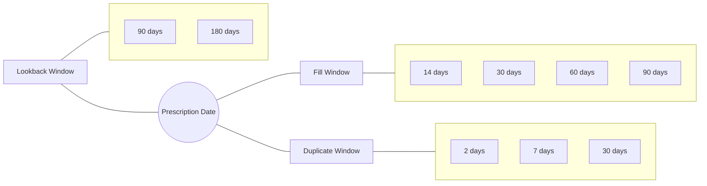

# MODELING RATES OF PRIMARY MEDICATION NONADHERENCE WITH SPECIALTY ONCOLYTIC AGENTS

Victoria W. Reynolds, PharmD, BCACP1, Autumn D. Zuckerman, PharmD, BCPS, AAHIVP, CSP1, Megan Peter, PhD1, Josh DeClercq, MS2, Leena Choi, PhD2, Elizabeth Mitchell3, Nisha Shah, PharmD1

1Vanderbilt Specialty Pharmacy, Vanderbilt University Medical Center; 2Department of Biostatistics, Vanderbilt University Medical Center; 3Lipscomb University College of Pharmacy

Vanderbilt University Medical Center logo

## INTRODUCTION

* Specialty pharmacies frequently calculate primary medication nonadherence (PMN) as an outcomes metric, but no standard method for calculating PMN exists, and no previous study has examined the effects of various parameters on PMN rate.

* The Pharmacy Quality Alliance (PQA) recommends calculating PMN with a 180-day lookback window, 30-day duplicate window, and 30-day fill window.1

* Previous rates of PMN range from 1.9% to 75%, demonstrating volatility in calculation methods.1

> **Study Objectives:**
> 1) Understand how different methodologies of calculating PMN impact results
> 2) Define a range of probable rates of PMN in oncology specialty agents

## METHODS

**Design**
* Single-center, retrospective
* Data from specialty oncolytic prescriptions sent to an integrated specialty pharmacy
* Limited to health system oncology provider

**Measures**
* Data were extracted from the pharmacy claims database.
* Prescription data were cross-referenced prescribers' clinical specialty and excluded if there was a reasonable assumption the medication was prescribed for a nononcology-related conditions.
* 24 methods were used to calculate PMN based on various combination of LBW, DW, and FW.

$$ \text{Rate of PMN} = \frac{\text{Number of prescriptions with PMN status}}{\text{Total number of eligible prescriptions}} $$

## Figure 1: Parameter Definitions

* **Lookback Window (LBW):** The minimum length of time before index prescription in which a patient may revert to naive status, and thus be eligible for PMN (i.e., a fill within this window results in a PMN-ineligible prescription).
* **Duplicate Window (DW):** The length of time in which two sequential prescriptions (i.e., no intervening dispensations, cancellations, transfers, etc.) can be considered a duplicate.
* **Fill Window (FW):** The duration of time for which a fill of an eligible prescription needs to occur to not be considered a case of PMN.

**Variable Days Used in Models:**
LBW: 90, 180
DW: 2, 7, 30
FW: 14, 30, 60, 90

## Figure 2: Effect of Parameters on PMN Rate

All 24 combinations of parameters are presented in the figure:

| Fill window (days) | LBW 90, DW 2 | LBW 90, DW 7 | LBW 90, DW 30 | LBW 180, DW 2 | LBW 180, DW 7 | LBW 180, DW 30 |
| ------------------ | ------------ | ------------ | ------------- | ------------- | ------------- | -------------- |
| 14                 | 23           | 22           | 20            | 23            | 21            | 19             |
| 30                 | 20           | 18           | 16            | 20            | 18            | 16             |
| 60                 | 19           | 17           | 16            | 19            | 17            | 15             |
| 90                 | 19           | 17           | 16            | 19            | 17            | 15             |

The number of eligible prescriptions was higher in shorter duplicate windows. Rate of PMN was lower in models with a fill window of 30 or more days.

## Table 1: Sample Characteristics

| Patient Characteristics (n = 1,422)      | Median \[IQR] or n (%) |
| ---------------------------------------- | ---------------------- |
| Age                                      | 54 \[64-72]            |
| Gender, male                             | 748 (53%)              |
| Race                                     |                        |
| White                                    | 1,182 (83%)            |
| African American                         | 144 (10%)              |
| Other                                    | 96 (7%)                |
| Prescription Characteristics (n = 4,482) | n (%)                  |
| Agent Class                              |                        |
| Alkylating agents                        | 573 (12.8%)            |
| Janus associated kinase inhibitor        | 424 (9.5%)             |
| Vascular endothelial growth factor       | 411 (9.2%)             |
| Antimetabolite                           | 398 (8.9%)             |
| Bruton's tyrosine kinase inhibitor       | 334 (7.5%)             |
| Cyclin-dependent kinase inhibitor        | 252 (5.6%)             |
| Antiandrogen                             | 246 (5.5%)             |
| Other\*                                  | 1,844 (41.8%)          |

\*Other prescribed agent classes included BCL-2 inhibitor, proteasome inhibitors chelating agents, multitarget kinase inhibits, BCR-ABL tyrosine kinase inhibitor, mTOR kinase inhibitor, poly ADP ribose polymerase inhibitors, BCR-ABL tyrosine kinase inhibitors, Colony stimulating factors, mitogen-activated protein kinase inhibitors, retinoic acid derivatives, nucleoside analogues, Antiangiogenic, and epidermal growth factor receptor inhibitors.

## RESULTS

## Table 2: PMN Modeling Results

| LBW (days) | Rx's in LBW (N) | DW (days) | Duplicate Rx's (N) | Eligible Rx's (N) | Rate of PMN in FW 14 days N (%) | Rate of PMN in FW 30 days N (%) | 60 days N (%) | 90 days N (%) |
| ---------- | --------------- | --------- | ------------------ | ----------------- | ----------------------------------- | ----------------------------------- | ------------- | ------------- |
| 90         | 3161            | 2         | 260                | 1061              | 246 (23%)                           | 210 (20%)                           | 202 (19%)     | 202 (19%)     |
|            |                 | 7         | 284                | 1037              | 222 (21%)                           | 186 (18%)                           | 178 (17%)     | 178 (17%)     |
|            |                 | 30        | 304                | 1017              | 202 (20%)                           | 166 (16%)                           | 158 (16%)     | 158 (16%)     |
| 180        | 3233            | 2         | 245                | 1004              | 234 (23%)                           | 198 (20%)                           | 192 (19%)     | 192 (19%)     |
|            |                 | 7         | 268                | 981               | 211 (22%)                           | 175 (18%)                           | 169 (17%)     | 169 (17%)     |
|            |                 | 30        | 286                | 963               | 193 (20%)                           | 157 (16%)                           | 151 (16%)     | 151 (16%)     |

LBW: Lookback window; Rx: prescription; DW: Duplicate window; PMN: primary medication nonadherence; FW: fill window

| Impact of adjustments on PMN rates: |                                |
| ----------------------------------- | ------------------------------ |
| FW:                                 | ↑ length of FW ↓ PMN rates |
| DW:                                 | ↑ length of DW ↓ PMN rates |
| LBW:                                | Minimal Impact ↔               |

The most drastic change in PMN occurred when FW was extended from 14 to 30 days.

PQA logo

## Figure 3: Prescription Outcomes

| Event            | 0    | 2    | 7    | 14   | 30   | 90   | 180  | 365  |
| ---------------- | ---- | ---- | ---- | ---- | ---- | ---- | ---- | ---- |
| Filled           | 10.6 | 28.2 | 54.3 | 61.9 | 66.4 | 67.4 | 67.5 | 67.5 |
| Duplicate        | 19.5 | 20.5 | 21.4 | 21.8 | 22.6 | 23.4 | 23.6 | 23.6 |
| External reroute | 3.5  | 4.7  | 5.4  | 5.6  | 5.8  | 5.9  | 6    | 6.1  |
| Cancel           | 0    | 0.2  | 0.3  | 0.4  | 0.4  | 0.4  | 0.4  | 0.4  |

The cumulative percentage of each event is enumerated for each x-axis tick in the above table.

| Prescription Event | Time Impact Summary                                                                                                                                    |
| ------------------ | ------------------------------------------------------------------------------------------------------------------------------------------------------ |
| Fills              | \* Most prescriptions were filled within 7 days of prescription date. \* The number of fills escalated with time, then leveled out around 30 days. |
| Duplicates         | \* Most duplicate prescriptions were sent within one day of the original prescription.                                                                 |
| External Reroutes  | \* Few prescriptions were rerouted. \* Most reroutes occurred within 2 days of prescribing.                                                        |
| Cancellations      | \* Very few prescriptions were cancelled.                                                                                                              |

## CONCLUSIONS

* The PQA-endorsed PMN calculation of 180-day LBW, 30-day DW, and 30-day FW resulted in the lowest rate of PMN from any method (16%). A shorter FW had the largest impact on PMN rates.
* When using PMN as a reporting metric, pharmacies should include comprehensive methods as DW and FW may impact results.

Reference:
1. Adams AJ, Stolpe SF. Defining and measuring primary medication nonadherence: development of a quality measure. *J Manag Care Spec Pharm*, 2016, 22, 516-23.

