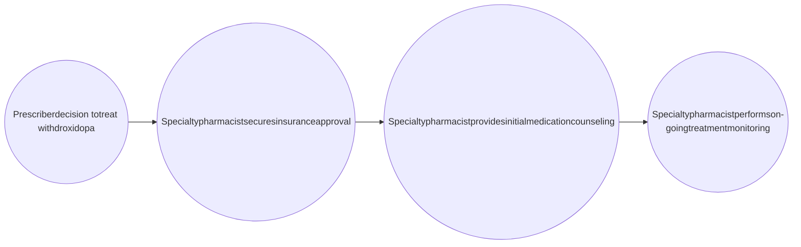

# PERSISTENCE ON DROXIDOPA FOR THE MANAGEMENT OF ORTHOSTATIC HYPOTENSION AT AN INTEGRATED CARE CENTER

SABRINA N. LIVEZEY, PHARMD, CSP1, JESSICA DANIELL, PHARMD CANDIDATE2, JOSH DECLERCQ, MS3, LEENA CHOI, PHD3, AUTUMN ZUCKERMAN, PHARMD, BCPS, AAHIVP CSP1, NISHA B. SHAH, PHARMD1

1VANDERBILT SPECIALTY PHARMACY, VANDERBILT UNIVERSITY MEDICAL CENTER, 2LIPSCOMB UNIVERSITY, 3DEPARTMENT OF BIOSTATISTICS, VANDERBILT UNIVERSITY MEDICAL CENTER

Vanderbilt University Medical Center logo

## BACKGROUND

* Droxidopa, an $\alpha/\beta$ agonist indicated for the treatment of neurogenic orthostatic hypotension1, has shown improvement in blood pressure, quality of life, and fall reduction2,3

* However, previous reports have found persistence to therapy to be challenging, most often due to lack of efficacy and adverse events (AEs).4

* Frequent monitoring and support by an integrated specialty pharmacist may improve persistence to droxidopa.

### Specialty Pharmacist Role in Outpatient Neurology Clinic

## OBJECTIVE

Evaluate persistence on droxidopa therapy in adult patients with symptomatic orthostatic hypotension receiving care within an integrated specialty pharmacy model

## METHODS

| Design             | Single-center, retrospective cohort                                                                                                                              |
| ------------------ | ---------------------------------------------------------------------------------------------------------------------------------------------------------------- |
| Sample             | Adult patients prescribed droxidopa with $\ge$3 medication fills by the center's specialty pharmacy                                                              |
| Study period       | May 2017 - September 2019                                                                                                                                        |
| Primary outcome    | Persistence, measured as time to first non-persistent event, defined as a coverage lapse > 60 days                                                               |
| Secondary Outcomes | Adherence measured by proportion of days covered (PDC) Health outcomes including patient-reported AEs and falls, emergency room visits, and hospitalizations |

## RESULTS

### Table 1. Patient characteristics (n=89)

| Patient Characteristic                 | n (%)      |
| -------------------------------------- | ---------- |
| Age (mean $\pm$ standard deviation)    | 71 $\pm$ 8 |
| Male gender                            | 57(64)     |
| Race                                   |            |
| Caucasian                              | 76(85)     |
| African American                       | 11(12)     |
| Not reported                           | 2(2)       |
| Insurance type                         |            |
| Commercial                             | 15(17)     |
| Medicare                               | 67(75)     |
| Medicaid                               | 2(2)       |
| Tricare                                | 5(6)       |
| Primary diagnosis                      |            |
| Parkinson's disease                    | 36(40)     |
| Pure autonomic failure                 | 29(33)     |
| Multiple system atrophy                | 10(11)     |
| Non-diabetic autonomic neuropathy      | 4(4)       |
| Non-neurogenic orthostatic hypotension | 4(4)       |
| Other\*                                | 6(7)       |

\*Other diagnoses: dopamine beta-hydroxylase deficiency, amyloidosis, diabetic neuropathy, autonomic failure secondary to diabetes, postural orthostatic tachycardia syndrome

### Table 2. Frequency of healthcare utilization related to droxidopa or orthostatic hypotension (n=89)

| Events 0 | Emergency department (ED) visit 78 (87.6%) | Hospitalization 80 (89.9%) |
| ------------ | ---------------------------------------------- | ------------------------------ |
| 1            | 9 (10.1%)                                      | 8 (9%)                         |
| 2            | 3 (1.1%)                                       | 1 (1.1%)                       |
| 3            | 3 (1.1%)                                       | --                             |

* ED visit and hospitalization data were collected from the electronic health record.

* Reasons for ED visits and hospitalizations included syncope and falls.

### Figure 1. Medication persistence (n=89)

| Time (months) | Probability of remaining persistent | Number at risk |
| ------------- | ----------------------------------- | -------------- |
| 0             | 1.00                                | 89             |
| 6             | 0.75                                | 61             |
| 12            | 0.63                                | 37             |
| 18            | 0.55                                | 15             |
| 24            | 0.52                                | 6              |

* The probability of a patient in the study still being on medication through 12 months is 0.63 (95% CI 0.53-0.75) with 23 patients censored.

* At 6 months, 61 patients (68.5%) were persistent.

* At the end of the study period, 55 patients (61.8%) were persistent.

* The median month of follow-up was 10.9 months.

### Figure 3. Median adherence (n=89)

| Group                 | Median PDC (%) |
| --------------------- | -------------- |
| Persistent (Censored) | 99             |
| Nonpersistent         | 90             |
| Combined              | 97             |

* Median PDC: persistent = 0.99, non-persistent = 0.90, combined = 0.97

* Mean number of fills: persistent = 14.8 fills, non-persistent = 10.1 fills

* 13% (n=12) of patients considered non-adherent with PDC < 80%

### Figure 2. Fall rate (n=77)

| Number of falls | Percentage of patients (%) |
| --------------- | -------------------------- |
| 0               | 44                         |
| 1               | 23                         |
| 2               | 12                         |
| 3               | 10                         |
| 4               | 5                          |
| 5               | 3                          |
| 6               | 2                          |
| 9               | 1                          |

* Patient-reported fall data was available for 77 patients.

* More than half of these patients reported at least one fall on droxidopa.

### Figure 4. Patient-reported adverse events (n=28)

| Adverse Event           | Number reported |
| ----------------------- | --------------- |
| Hypertension            | 22              |
| Urinary Tract Infection | 5               |
| Dizziness               | 4               |
| Central Nervous System  | 4               |
| Gastrointestinal        | 4               |
| Edema                   | 2               |

* A total of 41 AEs were reported by 28 patients.

* Hypertension was the most commonly reported AE.

## CONCLUSIONS

* Despite close monitoring for AEs and treatment efficacy, many patients were not persistent through 12 months of therapy. In those that maintain on therapy, high rates of adherence were seen.

* The neurology specialty pharmacist closely monitored efficacy and AEs.

* Future analysis will focus on reasons for non-persistence and correlation between AEs and healthcare utilization with persistence.

1. Droxidopa. Lexi-Drugs. Lexicomp. Wet al. Accessed February 27, 2020. 2. François C, Shibao CA, Biaggioni I, 2019 Mar 7. doi:10.1002/mdc3.12726 3. Kaufmann H, Freeman R, Biaggioni I, et al. Neurology. 2014 4. Biaggioni I, Arthur Hewitt L, Rowse GJ, Kaufmann H. BMC Neurol. 2017

