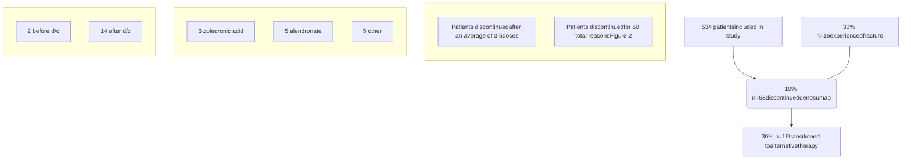

# Rates, reasons, and timing for treatment discontinuation in patients prescribed denosumab

Vanderbilt University Medical Center logo

W. Taylor Gregory1; Hannah M. Gipson1; Anwesa Chakrabarti, PharmD2; Megan Peter, PhD2
1College of Pharmacy, University of Tennessee Health Science Center, 2Specialty Pharmacy, Vanderbilt University Medical Center

## BACKGROUND

* Denosumab is a clinic-administered subcutaneous injection given every six months to treat osteoporosis.1,2

* Denosumab increases bone density and decreases fracture risk, but patients who discontinue without transitioning to an alternative therapy have increased fracture risk.3

* Understanding when and why patients discontinue denosumab might prepare clinicians to address common barriers to treatment adherence and persistence.

## OBJECTIVES

To assess:

1. Rates and reasons for discontinuation

2. Proportion of patients who transition to alternative therapy after discontinuation

3. The frequency and timing of fractures relative to discontinuation

## METHODS

**Design**: Retrospective cohort study
**Setting**: Academic health center in Southeast United States
**Sample**: Adult patients who received 2+ doses of denosumab from 2010 to 2018
**Measures**:
* Demographics
* Treatment date(s)
* Fracture date(s)
* Treatment discontinuation (yes/no). If yes:
    * Date and reason(s) for discontinuing
    * Whether patient transitioned to alternative therapy

## RESULTS

### Figure 1. Rate, Timing, and Outcomes of Treatment Discontinuation

### Table 1. Sample Demographics

| Characteristic | Median \[IQR] or n(%) All patients (n=534) | Median \[IQR] or n(%) Patients who discontinued (n=53) |
| -------------- | ---------------------------------------------- | ---------------------------------------------------------- |
| Age, years     | 69 \[62-77]                                    | 71 \[65-79]                                                |
| Gender         |                                                |                                                            |
| Female         | 461 (86%)                                      | 49 (92%)                                                   |
| Male           | 73 (14%)                                       | 4 (8%)                                                     |
| Race           |                                                |                                                            |
| White          | 506 (95%)                                      | 51 (96%)                                                   |
| Black          | 18 (3%)                                        | 1 (2%)                                                     |
| Other          | 10 (2%)                                        | 1 (2%)                                                     |

### Figure 2. Reasons for Discontinuation

| Reason                                      | Percentage |
| ------------------------------------------- | ---------- |
| Adverse effects (n=37)                      | 62         |
| Cost or insurance problems (n=5)            | 8          |
| Patient decision or preference (n=5)        | 9          |
| Transportation or scheduling problems (n=2) | 3          |
| Other or unknown (n=11)                     | 18         |

### Adverse Effects (n=37)

| Adverse Effect            | Count |
| ------------------------- | ----- |
| Musculoskeletal pain      | 12    |
| Dermatologic problems     | 9     |
| Dental problems           | 3     |
| Infection                 | 2     |
| Gastrointestinal problems | 2     |
| Other adverse effects     | 9     |

## CONCLUSIONS

### Key Findings

* Denosumab discontinuation was most often due to adverse effects.

* Cost and logistic factors were also common reasons.

* Most patients did not transition to alternative therapy after discontinuing.

### Pharmacist Role

* Pharmacists can positively impact patient outcomes by educating patients on the importance of medication adherence and helping patients mitigate adverse effects.

* When therapy must be modified because of low tolerability, pharmacists can recommend alternative therapy options to patients and prescribers.

### Future Directions

* Additional research is needed to design and test pharmacist interventions that promote high patient adherence and persistence to osteoporosis treatment.

### REFERENCES

1. Cummings SR, San Martin J, McClung MR, et al. Denosumab for prevention of fractures in postmenopausal women with osteoporosis. N Engl J Med 2009; 361:756.

2. Bone HG, Bolognese MA, Yuen CK, et al. Effects of denosumab on bone mineral density and bone turnover in postmenopausal women. J Clin Endocrinol Metab 2008; 93:2149.

3. Cummings SR, Ferrari S, Eastell R, et al. Vertebral Fractures After Discontinuation of Denosumab: A Post Hoc Analysis of the Randomized Placebo-Controlled FREEDOM Trial and Its Extension. J Bone Miner Res 2018; 33:190.

