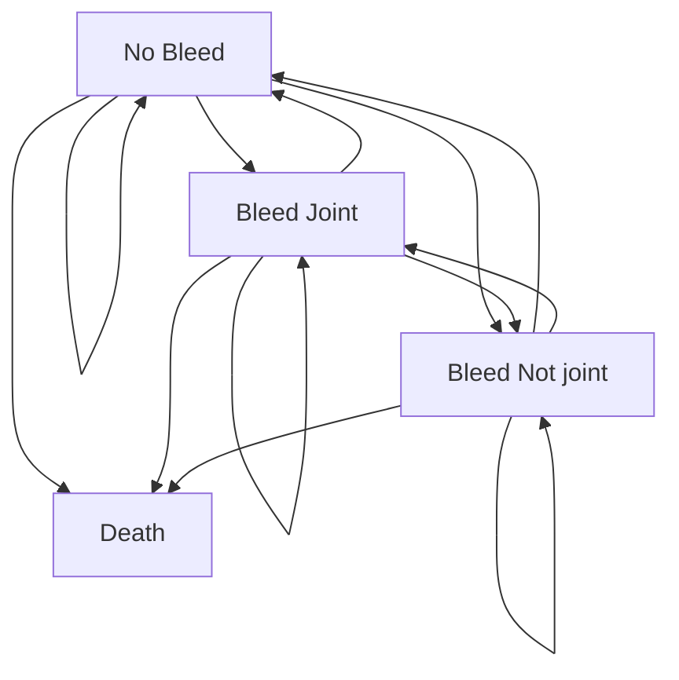

# The Economic Burden of Hemophilia B – A Lifetime Decision Analytic Model

Nanxin (Nick) Li1, Eileen K. Sawyer1, Konrad Maruszczyk2, Marta Slomka2,3, Tom Burke2, Antony P. Martin2, Matt Stevenson4, Greg Guzauskas2,5, Jamie O’Hara2,6
1uniQure Inc., Lexington, MA, USA; 2HCD Economics, Daresbury, UK; 3Mossakowski Medical Research Centre PAS, Warsaw, Poland; 4The University of Sheffield, Sheffield, UK; 5University of Washington, Seattle, WA, USA; 6Faculty of Health and Social Care, University of Chester, Chester, UK

Poster No:     

## INTRODUCTION

* Hemophilia B (HB) requires lifelong treatment to prevent or manage bleeding and associated morbidity.1

* HB is managed by factor IX (FIX) replacement therapy, including standard half-life [SHL] FIX prophylaxis, extended half-life [EHL] FIX prophylaxis, and FIX on-demand.2,3

* Frequent intravenous administration of FIX can be burdensome to people with HB (PwHB) and is associated with a significant cost to the health care system.4

## OBJECTIVES

* To develop a decision analytic model that estimates the adult lifetime costs associated with HB treatment options: SHL FIX prophylaxis, EHL FIX prophylaxis, and FIX on-demand.

* To identify the key drivers behind the overall cost of HB management.

## MATERIALS & METHODS

* An expert panel consisting of clinicians, health technology assessment specialists, and patient advocacy representatives evaluated and reached a consensus on the model framework.

* A Markov model (**Figure 1**) was developed to reflect the natural course of the disease for adult patients with severe and moderately severe HB. The model consists of four health states: "no bleed", "bleed (not joint)", "bleed (joint)" and "dead".

* Sub-models were based on the number of problem joints (PJs) acquired by PwHB: 0, 1, and 2+. This allowed different patterns of healthcare resource utilization due to joint deterioration to be factored in.

* Both societal and US third-party payer perspectives were considered, with lifetime horizon as the base-case and shorter time horizon of three, five, and ten years as sensitivity analyses.

* All costs were in 2019 USD($) and the discount rate was 3%.

* Model inputs were tested in one-way sensitivity analysis (OWSA) primarily based on their 95% confidence interval.

## Figure 1: Model Structure

Sub-Models Based on Number of Problem Joints

Sub-Models Based on Number of Problem Joints: 0 Problem Joints, 1 Problem Joint, ≥ 2 Problem Joints

**Bleed Events Markov Model**
(Same for Each Problem Joint Sub-Model)

## RESULTS

* Model results showed a substantial cost of HB management associated with all three treatment options. The adult lifetime total cost per patient was $21,086,607 for SHL FIX prophylaxis, $22,987,483 for EHL FIX prophylaxis, and $20,971,826 for FIX on-demand treatment (**Figure 2**).

* Most of the direct medical cost for HB management is driven by FIX treatment, estimated at $19,754,862 and $22,202,092 for prophylaxis with SHL and EHL FIX prophylaxis, respectively (both over 90% of direct medical cost) and at $12,179,003 for FIX on-demand treatment (close to 60% of direct medical cost).

* At shorter time horizons, the total cost per patient ranged from $2,222,259 to $2,423,501 for 3-year, $3,583,247 to $3,919,760 for 5-year, and $6,652,866 to $7,278,430 for 10-year across all three treatment arms.

## Figure 2: Summary of Model Results

| Time Horizon | Treatment Arm | FIX treatment ($) | Other medical ($) | Non-medical and indirect ($) | Total Cost ($) |
| ------------ | ------------- | ----------------- | ----------------- | ---------------------------- | -------------- |
| 3 Years      | SHL           |                   |                   |                              | 2,222,259      |
| 3 Years      | EHL           |                   |                   |                              | 2,423,501      |
| 3 Years      | OD            |                   |                   |                              | 2,217,112      |
| 5 Years      | SHL           |                   |                   |                              | 3,583,247      |
| 5 Years      | EHL           |                   |                   |                              | 3,919,760      |
| 5 Years      | OD            |                   |                   |                              | 3,594,471      |
| 10 Years     | SHL           |                   |                   |                              | 6,652,866      |
| 10 Years     | EHL           |                   |                   |                              | 7,278,430      |
| 10 Years     | OD            |                   |                   |                              | 6,674,713      |
| Lifetime     | SHL           | 19,754,862        |                   |                              | 21,086,607     |
| Lifetime     | EHL           | 22,202,092        |                   |                              | 22,987,483     |
| Lifetime     | OD            | 12,179,003        |                   |                              | 20,971,826     |

* OWSA results were generally consistent with the base-case results. Total adult lifetime cost of HB management was most sensitive to variation in the unit cost of FIX, discount rates, and the number of injections needed to treat a bleed, regardless of the treatment arm (see **Figure 3** for representative results of SHL FIX prophylaxis).

## LIMITATIONS

* Limitations of this study include the assumptions used in economic modelling, for example, the baseline distribution of proportion of patients with 0, 1, and 2+ PJs. However, extensive sensitivity analyses were conducted to test model inputs.

* The model also did not capture the impact of HB on caregivers.

## Figure 3: Sensitivity analysis results

SHL: Total cost ($)

| Parameter                                    | Lower bound ($) | Upper bound ($) |
| -------------------------------------------- | --------------- | --------------- |
| Discount rate costs                          |                 |                 |
| SHL per IU cost ($)                          |                 |                 |
| SHL dose frequency                           |                 |                 |
| Prophylaxis dose SHL                         |                 |                 |
| Number of injections to treat a bleed        |                 |                 |
| Weight table 20-39                           |                 |                 |
| On-demand dose SHL                           |                 |                 |
| Bleed (joint): 0 PJ ($)                      |                 |                 |
| Bleed (not joint): 0 PJ ($)                  |                 |                 |
| ABR\_SHL                                     |                 |                 |
| Weight table 40-56                           |                 |                 |
| Bleed (joint): 1 PJ ($)                      |                 |                 |
| Bleed (not joint): 1 PJ ($)                  |                 |                 |
| Weight table ≥60                             |                 |                 |
| ABR\_SHL\_1PJ                                |                 |                 |
| Baseline distribution: 0 PJ                  |                 |                 |
| Total annual indirect cost - Prophylaxis ($) |                 |                 |
| Bleed (joint): ≥2 PJ ($)                     |                 |                 |
| Bleed (not joint): ≥2 PJ ($)                 |                 |                 |
| ABR\_SHL\_2PJ                                |                 |                 |

## CONCLUSIONS

* The model results show a substantial economic burden at over $20 million per patient among patients with severe and moderately severe HB, regardless of the treatment strategy used.

* Cost of FIX treatment is the leading cost driver.

* These findings highlight the unmet medical need for PwHB.

## REFERENCES

1. Chen CX, et al. *Value Heal.* 2017;20(8):1074-1082. doi:10.1016/j.jval.2017.04.017

2. Peyvandi F, et al. *Lancet.* 2016;388(10040):187-197. doi:10.1056/NEJMoa067659

3. Manco-Johnson MJ, et al. *N Engl J Med.* 2007;357(6):535-544. doi:10.1056/NEJMoa067659

4. Gringeri A et al. *J Thromb Haemost.* 2011;9(4):700-710. doi:10.1111/j.1538-7836.2011.04214.x

## ACKNOWLEDGEMENT

This work was supported by uniQure Inc.

Presented at the AMCP NEXUS 2020 Oct. 20-23, Las Vegas

Presented at the National Association of Specialty Pharmacy (NASP) Annual Meeting & Expo Virtual Experience, September 14-18, 2020

