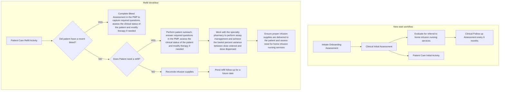

SHIELDS HEALTH SOLUTIONS logo

UMassMemorial Health Care logo

NYU Langone Health logo

# Development of an evidence-based specialty pharmacy program for hemophilia

Kristen Ditch1, PharmD, BCCCP; Jennifer L. Donovan1, PharmD; Brooke Ruhland1, PharmD, CSP; Brian S. Smith1, PharmD; Melissa Racine1, MS, RN; Lauren Mills1, Kate Campagnola1, PharmD; Ameet Wattamwar2, PharmD; Kate Smullen1, PharmD, CSP; Stacy Walton1, RN, BSN
1 – Shields Health Solutions, Stoughton, MA ; 2 – NYU Langone Hospitals, New York, NY

## Background

* Hemophilia patients have complex treatment regimens requiring enhanced specialized care and expertise. It is essential for specialty pharmacies to develop and support a comprehensive care model to manage hemophilia patients

* The National Hemophilia Foundation’s Medical and Scientific Advisory Council (MASAC) recommendations regarding standards of service for pharmacy providers of clotting factor concentrates states qualified specialty pharmacies must be knowledgeable, comprehensive, timely and accurate, accessible, safe and thorough to ensure quality care is delivered1

* In January 2020, UMass Memorial Medical Center, Worcester, MA, an academic medical center specialty pharmacy, launched a pharmacist-nurse hemophilia program to deliver customized care

## Objective

* To describe the process of designing and implementing an evidence-based hemophilia program that uses a pharmacist-nurse clinical model to deliver comprehensive patient care

## Methods

* A literature search between 1/1/2010 to present was conducted to identify clinically meaningful hemophilia outcomes and their associated definitions

* MASAC treatment guidelines were searched for recommendations pertaining to the outpatient management of hemophilia patients

* Data elements required by commercial payors in the hemophilia market, and accreditation standards pertaining to specialty pharmacy, were compiled

* These data elements were built into an internal patient management platform (PMP) utilized by a hemophilia nurse and specialty pharmacists to track patient outcomes and to perform patient outreach while implementing customized care plans

* The specialty pharmacy established home infusion nursing services by identifying home infusions agencies used by the hemophilia patients and in collaboration with the hematologists. Calls were placed to two home infusion companies preferred by patients in the region and contracts with the specialty pharmacy were established

## Results

**Hemophilia Clinical Nurse Assessments**

### Contract Nursing Services

| Two home infusion nursing agencies were identified, and contracts established | The hemophilia nurse makes a referral to one of the agencies and provides the following information: Patient demographics, medication or supply order(s), and a description of intravenous access |
| ----------------------------------------------------------------------------- | ------------------------------------------------------------------------------------------------------------------------------------------------------------------------------------------------- |

### Commercial Payors

| 11 Commercial payors identified | A total of 25 unique requirements that fall into the following categories were incorporated into the PMP: |
| ------------------------------- | --------------------------------------------------------------------------------------------------------- |
|                                 | \* Clinical interventions                                                                                 |
|                                 | \* Assay management                                                                                       |
|                                 | \* Medication adherence                                                                                   |
|                                 | \* Bleed management                                                                                       |
|                                 | \* Baseline parameters                                                                                    |
|                                 | \* Clinical outcomes (e.g., target joints, inhibitor management)                                          |

## Results (continued)

| Accreditation Standards               |                                                                               |
| ------------------------------------- | ----------------------------------------------------------------------------- |
| 58 Patient documentation requirements | The following patient management focus areas were incorporated in to the PMP: |
|                                       | \* Clinical assessments                                                       |
|                                       | \* Patient demographics                                                       |
|                                       | \* Goals of therapy                                                           |
|                                       | \* Medication list                                                            |
|                                       | \* Education & counseling                                                     |
|                                       | \* Drug utilization review                                                    |
|                                       | \* Clinical interventions                                                     |
|                                       | \* Welcome packet                                                             |
|                                       | \* Prescription information                                                   |
|                                       | \* Functional limitations                                                     |
|                                       | \* Benefits investigation                                                     |
|                                       | \* Copay & copay assistance                                                   |

| Clinically Meaningful Hemophilia Outcomes |                                                                 |
| ----------------------------------------- | --------------------------------------------------------------- |
| 9 Clinical outcomes identified            | The following clinical outcomes were incorporated into the PMP: |
|                                           | \* Hemophilia related comorbid conditions                       |
|                                           | \* Annualized bleeding rate³                                    |
|                                           | \* Pain assessment                                              |
|                                           | \* Life-threatening bleeds                                      |
|                                           | \* Timeliness to treat²                                         |
|                                           | \* Evaluation of supply on-hand⁴                                |
|                                           | \* Vaccination status                                           |
|                                           | \* Medication regimen⁵                                          |
|                                           | \* Monitoring dental visits                                     |

## Conclusions

* A systematic approach to gathering requirements from payors, accreditation organizations, and clinical best practices served as a foundation to build a hemophilia program

* On-going evaluation of patient care outcomes will serve to validate the quality care provided by the hemophilia nurse and specialty pharmacists

## References

1. Medical and Scientific Advisory Committee. MASAC recommendation regarding Standards of Service for Pharmacy Provider of Clotting Factor Concentrates for Home Use to Patients with Bleeding Disorders. MASAC Document # 188. National Hemophilia Foundation 2008.

2. Srivastava A, et al. WFH Guidelines for the management of hemophilia. Haemophilia 2013;19, e1-e47

3. Chai-Adisaksopha C., et al. A systematic review of definitions and reporting of bleeding outcome measures in haemophilia. Haemophilia 2015; 21: 731-735

4. Medical and Scientific Advisory Committee. MASAC recommendation regarding home factor supply for emergency preparedness for patients with hemophilia and other bleeding disorders. MASAC Document #227. National Hemophilia Foundation 2014.

5. Medical and Scientific Advisory Committee. MASAC recommendation regarding recommendation on the use and management of emicizumab-KXWH (Hemlibra®) for hemophilia A with and without inhibitors. MASAC Document # 255. National Hemophilia Foundation 2018.

## Disclosures

The authors of this presentation have the following to disclosure concerning possible financial or personal relationships with commercial entities that may have a direct or indirect interest in the subject matter of this presentation.

KD: Employee of Shields Health Solutions

