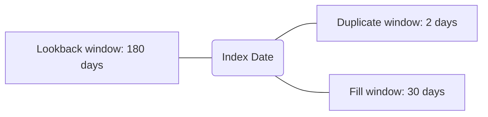

# Assessing Reasons for Primary Medication Non-adherence in Oncology Specialty Medications Vanderbilt University Medical Center logo

Andrea M. McDonald1, Elizabeth Mitchell1, Victoria W. Reynolds, PharmD, BCACP2, Nisha Shah, PharmD2, Megan Peter, PhD2, Josh DeClercq, MS3, Leena Choi, PhD3, Autumn D. Zuckerman, PharmD, BCPS, AAHIVP, CSP2

1Lipscomb University College of Pharmacy; 2Vanderbilt Specialty Pharmacy, Vanderbilt University Medical Center; 3Department of Biostatistics, Vanderbilt University Medical Center

## BACKGROUND

* Primary medication non-adherence (PMN) occurs when a new medication is prescribed, but not obtained by the patient within an acceptable time period.1

* Reasons for PMN are complex and may not be accurately captured using only prescription claims data.2

* The aim of this study was to identify reasons for PMN in adult patients prescribed specialty oral oncolytic agents.

## METHODS

Single-center, retrospective cohort analysis of prescriptions for specialty oral oncolytic agents that were:

* Prescribed by a Vanderbilt University Medical Center provider

* Prescribed to an adult patient

* Sent to Vanderbilt Specialty Pharmacy (VSP)

* Between January-December 2018

| Table 1. PMN Parameter Definitions | Table 1. PMN Parameter Definitions                                                                                                                                               |
| ---------------------------------- | -------------------------------------------------------------------------------------------------------------------------------------------------------------------------------- |
| Lookback window (LBW)              | Minimum length of time prior to the index prescription in which a patient may revert to naïve status, and thus be a potential instance of PMN                                    |
| Duplicate window (DW)              | Length of time in which 2 sequential prescriptions can be considered duplicate                                                                                                   |
| Fill window (FW)                   | Duration of time a fill of an eligible prescription needs to occur in order to not be considered a case of PMN                                                                   |
| PMN-eligible prescription          | No fill of any oncology medication in 180 day LBW No duplicate prescription sent within 2 days No prescription reroute to external specialty pharmacy (SP) within 2 days |

Figure 1. Primary medication non-adherence model

$$ \text{Rate of PMN} = \frac{\text{Number of prescriptions with PMN status}}{\text{Total number of eligible prescriptions}} $$

## RESULTS

**Figure 3. Prescription Eligibility and PMN Rates**

| Category                          | Count / Value |
| --------------------------------- | ------------- |
| Prescriptions reviewed            | 4,482         |
| Eligible prescriptions            | 1,004         |
| Not PMN                           | 806           |
| - Prescriptions filled on time    | 668           |
| - Prescriptions externally routed | 138           |
| Potential instances of PMN        | 198           |
| Misidentified as PMN              | 161           |
| True instances of PMN             | 37            |
| Calculated PMN rate               | 19.7%         |
| True PMN rate                     | 3.7%          |

> Most prescriptions not considered PMN due to being filled within the specified time period

**Figure 4. Reasons for Misidentified PMN (N=161)**

| Reason                    | N  |
| ------------------------- | -- |
| Rerouted to external SP   | 52 |
| Manufacturer fill         | 42 |
| Duplicate outside of DW   | 15 |
| Non-onc/heme condition    | 14 |
| Inpatient fill            | 14 |
| Clinical trial medication | 10 |
| Prescribed early          | 7  |
| Other\*                   | 4  |
| Filled by VSP             | 3  |

\*Other reasons for misidentified PMN: prescribed to cover a shipment delay, patient already on therapy with enough medication on-hand, erroneous automated refill and erroneous prescription

**Figure 5. Reasons for True PMN (N=37)**

| Reason            | N  |
| ----------------- | -- |
| Patient decision  | 12 |
| Medication change | 8  |
| Clinical decline  | 6  |
| Death             | 4  |
| Other\*           | 3  |
| Dose change       | 2  |
| Financial         | 2  |

\*Other reasons for PMN: medication no longer clinically appropriate, patient unreachable and medication held for imaging

| Table 2. Demographics for True PMN Cases Baseline Characteristics (n=37) | Table 2. Demographics for True PMN Cases M ± SD or n (%) |
| ---------------------------------------------------------------------------- | ------------------------------------------------------------ |
| Age, years                                                                   | 65 ± 16                                                      |
| Gender, Male                                                                 | 25 (68)                                                      |
| Race, Caucasian                                                              | 32 (87)                                                      |
| Alcohol use (past 6 months)                                                  | 12 (32)                                                      |
| Current or former smoker                                                     | 24 (65)                                                      |
| Charlson Comorbidity Index Score                                             | 7.1 ± 3.6                                                    |
| Hospitalization 3 months prior to prescription                               | 8 (22)                                                       |
| Surgery 6 months prior to prescription                                       | 3 (8)                                                        |
| Treatments 3 months prior to prescription                                    |                                                              |
| None                                                                         | 19 (51)                                                      |
| Radiation                                                                    | 2 (5)                                                        |
| Infusion                                                                     | 1 (3)                                                        |
| Other treatment                                                              | 15 (41)                                                      |

**Figure 2: Cancer Type for True PMN**

| Cancer Type | Percentage |
| ----------- | ---------- |
| Solid Organ | 54%        |
| Hematologic | 46%        |

## CONCLUSIONS

* The algorithm by which PMN is traditionally defined grossly overestimates the true rate of primary medication non-adherence.

* As only 18.6% of potential PMN prescriptions were true PMN, there is an inherent limitation in using only raw PMN as a quality metric for specialty pharmacies.

* Overall, the rate of PMN for oral oncolytics at a HSSP was very low and mostly due to medication change, clinical decline, or patient decision.

## REFERENCES

1. Adams AJ, Stolpe SF. Defining and Measuring Primary Medication Nonadherence: Development of a Quality Measure. *Journal of Managed Care & Specialty Pharmacy*. 2016;22(5):516-523. doi:10.18553/jmcp.2016.22.5.516.2.

2. Fischer MA, Stedman MR, Lii J, et al. Primary Medication Non-Adherence: Analysis of 195,930 Electronic Prescriptions. *Journal of General Internal Medicine*. 2010;25(4):284-290. doi:10.1007/s11606-010-1253-9.

