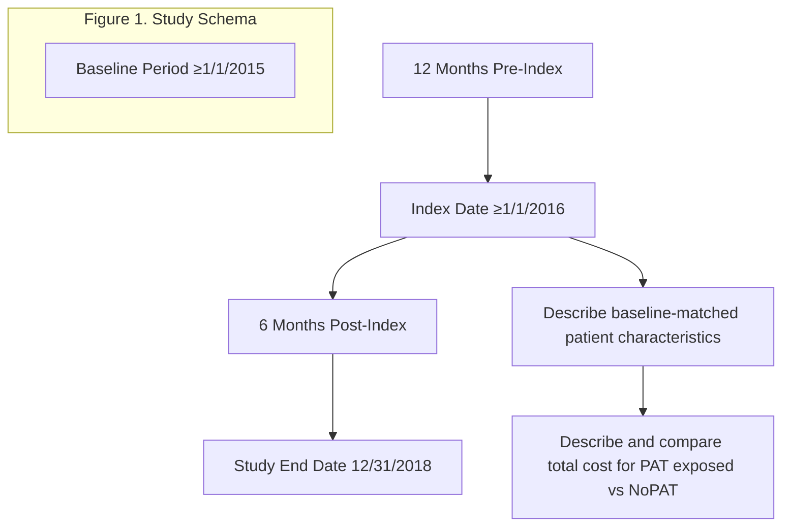

# Comparative Cost-Effectiveness Study of Hyperkalemia Management With Patiromer

Steven Coca1, Christopher G. Rowan2, Paula J. Alvarez3, Jeanene Fogli3, Nihar R. Desai4

1Icahn School of Medicine at Mount Sinai, New York, NY; 2COHRDATA, Santa Monica, CA; 3Relypsa, Inc., a Vifor Pharma Group Company, Redwood City, CA; 4Yale University, Center for Outcomes Research and Evaluation, New Haven, CT

## BACKGROUND

* Hyperkalemia (HK) is a serious condition and is associated with life-threatening cardiac arrhythmias and sudden death.1,2

* HK represents a common side effect of renin-angiotensin-aldosterone system inhibitor (RAASi) medications, which often limits their use.1,2

* HK has been shown to increase healthcare resource utilization (HRU) and cost for patients with cardiorenal conditions.3

## OBJECTIVE

* To assess the cost-effectiveness of treating HK with patiromer (PAT) vs. without patiromer (NoPAT) in a Medicare Advantage population.

## METHODS

* A retrospective, matched cohort study using a deidentified national commercial and Medicare Advantage claims database (Optum’s de-identified Clinformatics® Datamart) from January 1, 2016 through December 31, 2018.

* Two cohorts were identified: PAT (exposed) and NoPAT (unexposed).

* Patient inclusion criteria were HK event (HKE) with potassium (K+) ≥5.0 mEq/L; Medicare Advantage insurance; 6 months of continuous insurance coverage before index date; HK diagnosis within 12 months before index date.

| Table 1. Study Population | Table 1. Study Population PAT Cohort | Table 1. Study Population NoPAT Cohort |
| ------------------------- | ---------------------------------------- | ------------------------------------------ |
| Unmatched HKE number      | 1111                                     | 226,282                                    |
| Unmatched patients        | 1111                                     | 89,636                                     |
| Matched patients          | 1002                                     | 1002                                       |

* Propensity score matching and coarsened exact matching (CEM) with baseline variables were used to identify the complete set of matching unexposed and exposed HK episodes. The matched population included 2004 total patients with 1002 matched patients in each cohort at the index date (PAT dispensed date or HK diagnosis date).

* Follow-up began on the index date and ended at the first censoring event (insurance disenrollment, death, study end date [12/31/18], sodium polystyrene sulfonate [SPS] or sodium zirconium cyclosilicate [SZC] initiation, PAT discontinuation [exposed only], or PAT initiation [NoPAT only]).

* Cost outcomes were measured at 6 months post-index: total, inpatient, emergency department (ED), outpatient services, and outpatient pharmacy (mean US$; confidence interval [CI] 95%). The study population included 300 total patients with 150 patients in each cohort at 6 months.

## RESULTS

| Table 2. Matched Patient Demographics (n=1002/cohort)\* Number of qualifying HKE per patient | Table 2. Matched Patient Demographics (n=1002/cohort)\* Mean (SD) | Table 2. Matched Patient Demographics (n=1002/cohort)\* Median (IQR) |
| ------------------------------------------------------------------------------------------------ | --------------------------------------------------------------------- | ------------------------------------------------------------------------ |
| NoPAT HKE                                                                                        | 6.7 (5.9)                                                             | 5 (2, 9)                                                                 |
| PAT HKE                                                                                          | 3.7 (3.9)                                                             | 2 (1, 5)                                                                 |
| Age                                                                                              | Mean (SD)                                                             | Median (IQR)                                                             |
| NoPAT HKE                                                                                        | 74.1 (9.1)                                                            | 74.5 (68.7, 80.7)                                                        |
| PAT HKE                                                                                          | 74.4 (9.0)                                                            | 74.5 (69.1, 81.2)                                                        |
| Gender, n (%)                                                                                    | NoPAT HKE                                                             | PAT HKE                                                                  |
| Female                                                                                           | 385 (38)                                                              | 405 (40)                                                                 |
| Male                                                                                             | 617 (62)                                                              | 597 (60)                                                                 |
| Low income subsidy eligibility, n (%)                                                            | NoPAT HKE                                                             | PAT HKE                                                                  |
|                                                                                                  | **391 (39)**                                                          | **391 (39)**                                                             |

\*Bold numbers represent the variables that had CEM.
IQR, interquartile range; SD, standard deviation.

## RESULTS

| Table 3. Matched Baseline Comorbidities\* | Table 3. Matched Baseline Comorbidities\* Mean (SD) | Table 3. Matched Baseline Comorbidities\* Median (IQR) |
| ----------------------------------------- | ------------------------------------------------------- | ---------------------------------------------------------- |
| NoPAT HKE                                 | 4.9 (2.2)                                               | 5 (3, 6)                                                   |
| PAT HKE                                   | 5.0 (2.2)                                               | 5 (3, 6)                                                   |
|                                           | NoPAT HKE n (%)                                         | PAT HKE n (%)                                              |
| Chronic kidney disease                    | **976 (97)**                                            | **965 (96)**                                               |
| Diabetes mellitus                         | **731 (73)**                                            | **729 (73)**                                               |
| Coronary artery disease                   | **450 (45)**                                            | **442 (44)**                                               |
| Congestive heart failure                  | **346 (35)**                                            | **346 (35)**                                               |
| ESRD                                      | 102 (10)                                                | 112 (11)                                                   |

| Table 4. Matched Medications (12 Months Before Index Date)\* | Table 4. Matched Medications (12 Months Before Index Date)\* NoPAT HKE n (%) | Table 4. Matched Medications (12 Months Before Index Date)\* PAT HKE n (%) |
| ------------------------------------------------------------ | -------------------------------------------------------------------------------- | ------------------------------------------------------------------------------ |
| ACEi                                                         | 359 (36)                                                                         | 388 (39)                                                                       |
| ARB                                                          | 301 (30)                                                                         | 329 (33)                                                                       |
| MRA                                                          | 87 (9)                                                                           | 77 (8)                                                                         |
| Continuous RAASi exposure 6 months before index date         | **316 (32)**                                                                     | **316 (32)**                                                                   |
| Max RAASi dose                                               | **238 (24)**                                                                     | **238 (24)**                                                                   |
| SPS                                                          | 404 (40)                                                                         | 387 (39)                                                                       |
| Loop diuretic                                                | 480 (48)                                                                         | 508 (51)                                                                       |
| Beta blocker                                                 | 395 (39)                                                                         | 398 (40)                                                                       |
| Thiazide diuretic                                            | 210 (21)                                                                         | 218 (22)                                                                       |
| NSAID                                                        | 121 (12)                                                                         | 134 (13)                                                                       |
| Cyclosporine/tacrolimus                                      | 50 (5)                                                                           | 42 (4)                                                                         |

\*Bold numbers represent the variables that had CEM.
ACEi, angiotensin-converting enzyme inhibitor; ARB, angiotensin-receptor blocker; ESRD, end-stage renal disease; MRA, mineralocorticoid receptor antagonist; NSAID, nonsteroidal anti-inflammatory drug.

| Table 5. Matched Baseline K⁺ and eGFR Levels\* Baseline K⁺, mEq/L | Table 5. Matched Baseline K⁺ and eGFR Levels\* Mean (SD) | Table 5. Matched Baseline K⁺ and eGFR Levels\* Median (IQR) |
| --------------------------------------------------------------------- | ------------------------------------------------------------ | --------------------------------------------------------------- |
| NoPAT HKE                                                             | 5.6 (0.4)                                                    | 5.5 (5.3, 5.8)                                                  |
| PAT HKE                                                               | 5.6 (0.4)                                                    | 5.5 (5.3, 5.8)                                                  |
| Baseline K⁺ value mEq/L, n (%)                                        | NoPAT HKE                                                    | PAT HKE                                                         |
| K⁺ 5.0–<5.5                                                           | **389 (39)**                                                 | **389 (39)**                                                    |
| K⁺ 5.5–<6.0                                                           | **471 (47)**                                                 | **471 (47)**                                                    |
| K⁺ 6.0–<6.5                                                           | **114 (11)**                                                 | **114 (11)**                                                    |
| K⁺ ≥6.5                                                               | **28 (3)**                                                   | **28 (3)**                                                      |
| eGFR within 12 months before index date, mL/min/1.73m²                | Mean (SD)                                                    | Median (IQR)                                                    |
| NoPAT HKE                                                             | 35.6 (20.2)                                                  | 31.4 (19.9, 48.3)                                               |
| PAT HKE                                                               | 36.3 (20.9)                                                  | 31.2 (20.9, 47.2)                                               |
| eGFR category mL/min/1.73m², n (%)                                    | NoPAT HKE                                                    | PAT HKE                                                         |
| eGFR ≥90                                                              | 15 (2)                                                       | 27 (3)                                                          |
| eGFR 60–89                                                            | 117 (12)                                                     | 106 (11)                                                        |
| eGFR 30–59                                                            | 394 (39)                                                     | 401 (40)                                                        |
| eGFR 15–29                                                            | 337 (34)                                                     | 342 (34)                                                        |
| eGFR <15                                                              | 139 (14)                                                     | 126 (13)                                                        |

\*Bold numbers represent the variables that had CEM.
eGFR, estimated glomerular filtration rate.

| Table 6. Matched Medical and Pharmacy Costs (1 Month and 12 Months Before Index Date) Total medical costs: 1 month | Table 6. Matched Medical and Pharmacy Costs (1 Month and 12 Months Before Index Date) Mean US$ (SD) | Table 6. Matched Medical and Pharmacy Costs (1 Month and 12 Months Before Index Date) Median US$ (IQR) |
| ---------------------------------------------------------------------------------------------------------------------- | ------------------------------------------------------------------------------------------------------- | ---------------------------------------------------------------------------------------------------------- |
| NoPAT HKE                                                                                                              | 3453 (9288)                                                                                             | 601 (271, 1847)                                                                                            |
| PAT HKE                                                                                                                | 3248 (8467)                                                                                             | 601 (269, 1996)                                                                                            |
| Total medical costs: 12 months                                                                                         | Mean US$ (SD)                                                                                           | Median US$ (IQR)                                                                                           |
| NoPAT HKE                                                                                                              | 31,364 (55,624)                                                                                         | 13,288 (4886, 34,952)                                                                                      |
| PAT HKE                                                                                                                | 33,563 (62,226)                                                                                         | 13,437 (5249, 37,138)                                                                                      |
| Total drug costs: 1 month                                                                                              | Mean US$ (SD)                                                                                           | Median US$ (IQR)                                                                                           |
| NoPAT HKE                                                                                                              | 633 (1443)                                                                                              | 208 (52, 689)                                                                                              |
| PAT HKE                                                                                                                | 778 (2192)                                                                                              | 220 (49, 706)                                                                                              |
| Total drug costs: 12 months                                                                                            | Mean US$ (SD)                                                                                           | Median US$ (IQR)                                                                                           |
| NoPAT HKE                                                                                                              | 7031 (12,301)                                                                                           | 3831 (1502, 8174)                                                                                          |
| PAT HKE                                                                                                                | 8592 (17,507)                                                                                           | 4194 (1519, 8794)                                                                                          |

## Figure 2. Total Mean Costs PAT vs NoPAT at 6 Months (N=300) (P=0.012)

| Category            | Mean cost, US$ |
| ------------------- | -------------- |
| PAT                 | 19,311         |
| NoPAT               | 26,531         |
| PAT cost difference | (7220)         |

* Total mean costs showed that the PAT cohort produced a reduction of $7220 as compared with the NoPAT cohort at 6 months of continuous therapy. (Figure 2)

| Table 7. Matched HRU (12 Months Before Index Date) | Table 7. Matched HRU (12 Months Before Index Date) NoPAT HKE n (%) | Table 7. Matched HRU (12 Months Before Index Date) PAT HKE n (%) |
| -------------------------------------------------- | ---------------------------------------------------------------------- | -------------------------------------------------------------------- |
| Surgical claim                                     | 342 (34)                                                               | 326 (33)                                                             |
| ED visit                                           | 356 (36)                                                               | 333 (33)                                                             |
| Inpatient admission                                | 313 (31)                                                               | 312 (31)                                                             |
| SNF admission                                      | 68 (7)                                                                 | 65 (6)                                                               |
| HCP office visits                                  | Mean (SD)                                                              | Median (IQR)                                                         |
| NoPAT HKE                                          | 10.3 (10.3)                                                            | 9 (0, 16)                                                            |
| PAT HKE                                            | 9.6 (10.0)                                                             | 8 (0, 15)                                                            |
| Total days in hospital (LOS)                       | Mean (SD)                                                              | Median (IQR)                                                         |
| NoPAT HKE                                          | 2.4 (5.9)                                                              | 0 (0, 2)                                                             |
| PAT HKE                                            | 2.9 (7.3)                                                              | 0 (0, 2)                                                             |
| Total days in SNF (LOS)                            | Mean (SD)                                                              | Median (IQR)                                                         |
| NoPAT HKE                                          | 1.5 (7.4)                                                              | 0 (0, 0)                                                             |
| PAT HKE                                            | 1.4 (6.9)                                                              | 0 (0, 0)                                                             |

HCP, healthcare provider; LOS, length of stay; SNF, skilled nursing facility.

## DISCLOSURES

SC reports consultant fees from Relypsa, Inc., a Vifor Pharma Group Company; CGR reports consultant fees from AbbVie, Halozyme, and Relypsa, Inc., a Vifor Pharma Group Company; PJA and JF report employment by Relypsa, Inc., a Vifor Pharma Group Company, and stock in Vifor Pharma; NRD reports serving as a clinical investigator and receives consultant fees from Amgen, Boehringer Ingelheim, Cytokinetics, Novartis, SC Pharmaceuticals, and consultant fees from Relypsa, Inc., a Vifor Pharma Group Company.

## Figure 3. Patiromer Mean Cost Difference (Savings) by Category (6 Months)

| Category   | Mean cost difference, US$ |
| ---------- | ------------------------- |
| Pharmacy   | 3094                      |
| Outpatient | (815)                     |
| ED         | (4718)                    |
| Inpatient  | (4781)                    |

* The PAT cohort showed an increase in total pharmacy costs, but that increase was offset by a greater overall reduction in medical costs (ie, inpatient, ED, and outpatient). (Figure 3)

## LIMITATIONS

* This is an observational study; therefore, no causal claims can be made, only associations derived.

* We have assumed that patients are taking medications that are dispensed.

## CONCLUSIONS

* For patients with hyperkalemia, a 27% reduction ($7220) in total mean costs at 6 months was observed for patients exposed to patiromer compared to patients who did not receive patiromer.

* With 6 months of continuous patiromer therapy, the reduction in total (mean) medical costs (ie, inpatient, outpatient, and ED services) exceeded the increased cost to the outpatient pharmacy budget.

* These results suggest that patiromer utilization may be a cost-effective therapy for the chronic management of hyperkalemia.

* Further studies are needed to confirm these results.

## ACKNOWLEDGMENTS

Editorial support was provided by Impact Communication Partners, Inc., and funded by Relypsa, Inc., a Vifor Pharma Group Company.

## REFERENCES

1. Kovesdy CP, et al. Nat Rev Nephrol. 2014;10:653-662.
2. Einhorn LM, et al. Arch Intern Med. 2009;169:1156-1162.
3. Epstein M, et al. Am J Manag Care. 2016;22:s311-s324.

Presented at the National Association of Specialty Pharmacy Annual Meeting & Expo Virtual Experience, September 14-18, 2020

Supported by Relypsa, Inc., a Vifor Pharma Group Company

